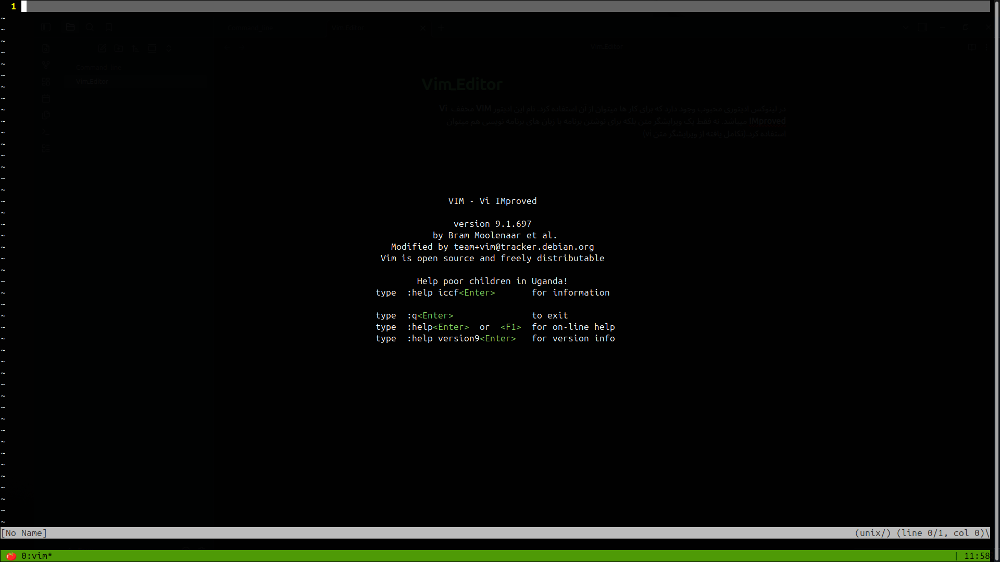

در لینوکس ادیتوری محبوب وجود دارد که برای کار ها میتوان از آن استفاده کرد. نام این ادیتور **VIM** مخفف **Vi IMproved** میباشد. نه فقط یک ویرایشگر متن بلکه برای نوشتن برنامه با زبان های برنامه نویسی هم میتوان استفاده کرد.(تکامل یافته از ویرایشگر متن vi)

فضای کلی ادیتور

در ادامه شورت کات های مربوط به کار با ویم در راه حرفه ای تر شدن را بررسی میکنیم.
